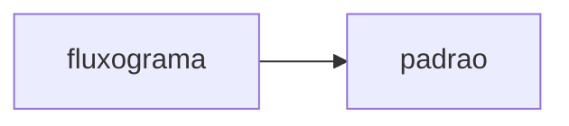

# downloader


Repositório para download async de arquivos gerais.



## ⚠️ Desenvolvimento

### 🧰 Requisitos

- [AWS CLI](https://aws.amazon.com/pt/cli/)
- [AWS SAM CLI](https://docs.aws.amazon.com/serverless-application-model/latest/developerguide/serverless-sam-cli-install-linux.html)
- [Poetry](https://aws.amazon.com/pt/cli/)
- [Docker](https://www.docker.com/)

### 🌎 Ativar ambiente

```bash
make python/ativar-ambiente
```

### 📝 Estilo de código

```bash
# Verifica e altera os arquivos (não inclui alertas Mypy)
make python/formatar-codigo
```

```bash
# Apenas verificar alertas (inclui Mypy)
make python/checar-codigo
```

### :factory: Variáveis de ambiente

Escreva aqui todas as variáveis de ambiente que necessitam ser exportadas para rodar o serviço apropriadamente!

#### AWS

```bash
aws_perfil=None
aws_ambiente=dev
aws_regiao=us-east-1
```

#### Local

```bash
perfil=None
ambiente=dev
regiao=us-east-1
```

### 🐳 Execução local
#### Com AWS SAM

O evento recebido na simulação de lambda deve estar no diretório `.aws/lambda/eventos`.

```bash
make aws/sam/executar-lambda-localmente --evento apigateway-proxy
```
#### Como script

```bash
export PYTHONPATH="${PYTHONPATH}:/src"
python src
```
### 🚀 CI/CD

Faça um push (ou merge) na main para executar lint e testes.

Crie um release contendo "prod" ou "dev" na tag para definir o ambiente de deploy. Exemplo: `v0.0.1-dev`.

#### :robot: Terraform

Caso ainda não haja infraestrutura criada na AWS, vá em `Actions` no repositório e rode a action `Terraform`.<br>
Para criar a infraestrutura no ambiente de desenvolvimento, escolha a branch `desenvolvimento` para rodar a action. Para criar em produção, escolha a branch `main`
